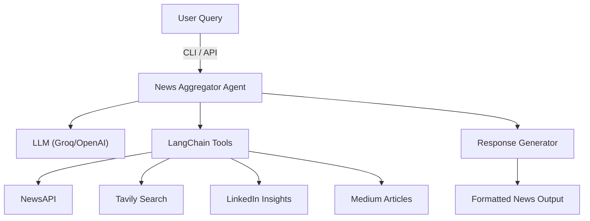

# 📰 News Aggregator Agent

[](https://www.python.org/)
[]
[]
[]
[](LICENSE)

---

## 🌟 Introduction

**News Aggregator Agent** is an intelligent news aggregation assistant powered by advanced LLMs, LangChain, and multiple news APIs. It helps users find relevant news and information from reputable sources across different categories, providing comprehensive coverage of topics they're interested in.

### **Key Highlights**
- 🔗 Integrates with multiple news APIs (NewsAPI, Tavily, etc.)
- 🧠 Powered by LangChain and LLMs for smart reasoning
- 📰 Aggregates news from reputable sources (AP, Reuters, BBC, TechCrunch, etc.)
- 💼 Includes professional insights from LinkedIn and Medium
- 🎯 Smart categorization (General, Technology, Business)
- 🌐 Multi-modal: works via CLI interface and REST API

---

## 🏗️ Architecture



---

## 🚀 Features

- **Multi-Source Aggregation:** News from AP, Reuters, BBC, TechCrunch, Bloomberg, and more
- **Smart Categorization:** Automatically categorizes news (General, Technology, Business)
- **Professional Insights:** Includes LinkedIn and Medium content for deeper analysis
- **Real-time Updates:** Latest news and information from multiple sources
- **Source Attribution:** Clear source attribution and publication dates
- **CLI Interface:** Easy-to-use command-line interface for quick news queries
- **API Integration:** REST API for programmatic access

---

## 🏁 Getting Started

### 1. **Clone the Repository**
```sh
git clone https://github.com/harmish/agentic_ai_project.git
cd agentic_ai_project/News_aggregator_agent
```

### 2. **Set Up the Environment**
Install [uv](https://github.com/astral-sh/uv) (fast Python package manager):
```sh
pip install uv
```
Create and activate a virtual environment:
```sh
uv venv env --python cpython-3.10.18-windows-x86_64-none
.\env\Scripts\activate
```

### 3. **Install Dependencies**
```sh
uv pip install -r requirements.txt
```

### 4. **Configure API Keys**
Create a `.env` file in the root directory with your API keys:
```env
# Required - Choose one LLM provider
GROQ_API_KEY="your_groq_api_key"
# OR
OPENAI_API_KEY="your_openai_api_key"

# Optional - For enhanced news coverage
TAVILY_API_KEY="your_tavily_api_key"
NEWS_API_KEY="your_news_api_key"
```
**Get your API keys:**
- [Groq](https://console.groq.com/) - Free tier available
- [OpenAI](https://platform.openai.com/api-keys) - Pay-per-use
- [Tavily](https://docs.tavily.com/) - Free tier available
- [NewsAPI](https://newsapi.org/) - Free tier available

### 5. **Run the Application**

**CLI Interface (Recommended):**
```sh
python cli_app.py
# Or with specific model provider
python cli_app.py groq
python cli_app.py openai
```

**FastAPI Backend:**
```sh
uvicorn main:app --reload --port 8000
```

---

## 💡 Example Usage

**CLI Query:**  
`What are the latest AI developments?`

**Agent Output:**
```
📰 News Aggregator Response - 2025-01-27 15:30:45
============================================================

💻 Technology News about 'latest AI developments':

🔧 Tech Sources:
1. **OpenAI Releases GPT-4.5 with Enhanced Reasoning Capabilities**
   OpenAI has announced the release of GPT-4.5, featuring improved reasoning abilities and reduced hallucinations...
   Source: TechCrunch
   Published: 2025-01-27T10:00:00Z
   Link: https://techcrunch.com/...

2. **Google's Gemini 2.0 Shows Significant Performance Improvements**
   Google's latest AI model demonstrates 40% better performance on benchmark tests...
   Source: Ars Technica
   Published: 2025-01-27T09:30:00Z
   Link: https://arstechnica.com/...

💼 LinkedIn Insights:
1. **The Future of AI in Enterprise: Key Trends for 2025**
   Industry leaders discuss the integration of AI in enterprise environments...
   Link: https://linkedin.com/...

📝 Medium Articles:
1. **Understanding Transformer Architecture: A Deep Dive**
   Comprehensive analysis of how transformer models work and their applications...
   Link: https://medium.com/...

============================================================
```

**API Query:**
```bash
curl -X POST "http://localhost:8000/query" \
     -H "Content-Type: application/json" \
     -d '{"question": "What are the latest developments in quantum computing?"}'
```

---

## ⚠️ Common Issues

- **API Key Errors:** Ensure all API keys are correct and enabled for the required services.
- **API Quotas:** Some APIs have free tier limits; exceeding them may cause failures.
- **Network Issues:** Check your internet connection if API calls fail.
- **Dependency Conflicts:** Use the recommended Python version and install dependencies in a clean virtual environment.
- **Model Provider Issues:** Ensure you have valid API keys for your chosen LLM provider (Groq or OpenAI).

---

## 📚 Documentation & References

- [LangChain Documentation](https://python.langchain.com/)
- [LangGraph Documentation](https://langchain-ai.github.io/langgraph/)
- [Groq API Documentation](https://console.groq.com/docs)
- [OpenAI API Documentation](https://platform.openai.com/docs)
- [Tavily API Documentation](https://docs.tavily.com/)
- [NewsAPI Documentation](https://newsapi.org/docs)

---

## 🔒 Security Notes

- **Never commit your `.env` file or API keys to public repositories.**
- **Regenerate your API keys if you suspect they are compromised.**
- **Restrict API keys to only the services and domains you need.**
- **Review third-party API usage and privacy policies.**

---

## 🚀 Future Enhancements

- **Speech-to-Text Integration:** Voice input for news queries
- **Text-to-Speech Output:** Audio news summaries
- **Multi-Agent Network:** Specialized agents for different news categories
- **Real-time Notifications:** Push notifications for breaking news
- **Personalized Feeds:** Custom news feeds based on user preferences

---

Enjoy staying informed with the News Aggregator Agent! 📰